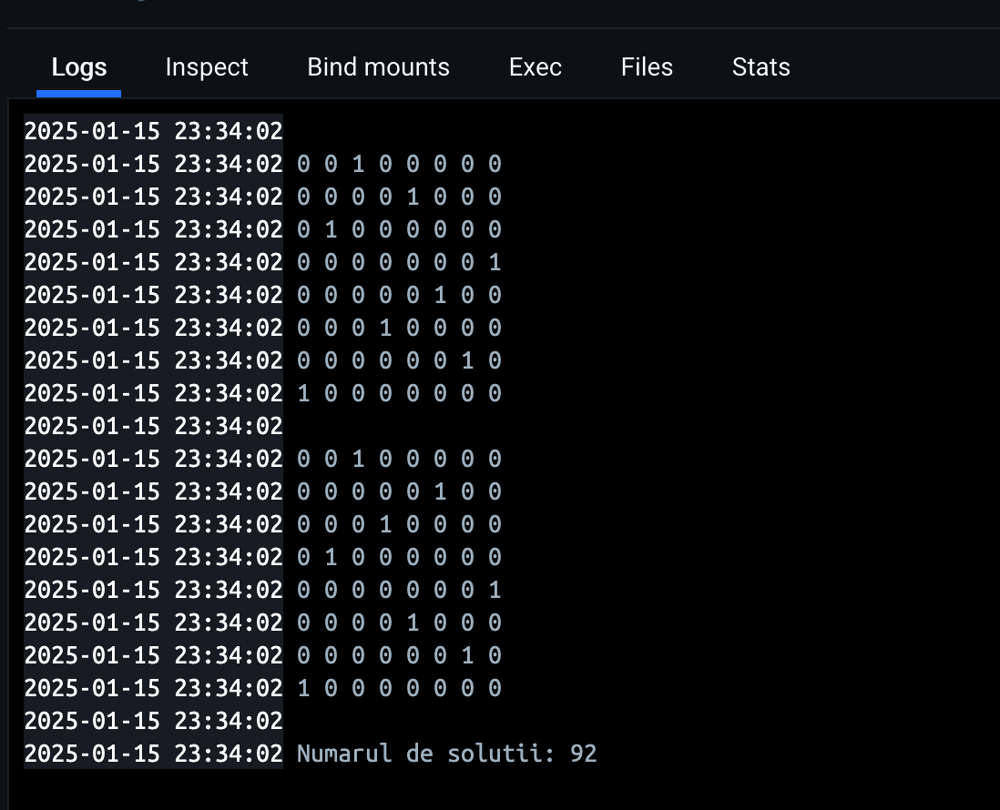

# Problema celor 8 regine
---
## Descrierea Proiectului

Problema celor 8 regine: să se scrie un program care plasează 8 regine pe tabla de șah, fără ca acestea să se atace reciproc. Problema a fost investigată de Carl Friedrich Gauss în 1850 și până astăzi aceasta nu are o soluție analitică, ci prin încercări. Problema are 92 de soluții, din care 12 sunt distincte (din motive de simetrie).

## Notarea Proiectului

**Punctaj**  
Proiectul va fi punctat după cum urmează:
1. **Implementarea într-un limbaj de programare la alegere**:
   - Temă de proiect din grupa A: 2 puncte
   - Temă de proiect din grupa B: 3 puncte
   - Temă de proiect din grupa C: 4 puncte
   - Temă de proiect din grupa D: 5 puncte
2. **Fișierele sursă sunt stocate într-un repository Git la alegere (GitHub, GitLab, etc.)**: 1 punct
3. **Repository-ul are commit-uri distincte, care arată evoluția proiectului întinsă pe o durată de timp rezonabilă**: 0,25 puncte
4. **Repository-ul conține fișierul .gitignore completat corespunzător și nu conține fișiere executabile și alte artefacte de compilare inutile**: 0,25 puncte
5. **Documentația (în fișierul README.md din rădăcina repository-ului)**:
   - Detalii despre implementare, platforma software utilizată, rezultate, modalitate de rulare, etc.: 0,5 puncte
   - Documentația este formatată cu Markdown: 0,5 puncte
   - Documentația afișează cel puțin o captură de ecran: 0,5 puncte
6. **Livrare proiect (deployment)**:
   - Container Docker stocat cu comenzi manuale (ex. git push) pe o platformă la alegere: 1 punct
___
## Funcționalitatea Proiectului

- **Afișarea soluțiilor**: Toate soluțiile valide sunt afișate în consolă sub formă de matrice.
- **Numărarea soluțiilor**: La final, programul afișează numărul total de soluții găsite.
- **Metoda utilizată**: Programul folosește backtracking pentru explorarea tuturor configurațiilor posibile ale reginelor pe tablă.
___
## Resurse Utilizate

### Mediul de Lucru
- **Sistem de operare**: macOS Sequoia
- **Editor cod**: VS Code

### Tehnologii 
- Docker
- Git/GitHub
___
## Rularea Proiectului

### Cu Docker

1. **Construirea imaginii Docker**:
   ```bash
   docker build -t nume_imagine .
   docker run -d -e GITHUB_TOKEN=your_personal_github_token nume_imagine

2. **Executarea programului**:
    ```bash
    ./main
    
## Exemplu de rulare


### Linkuri
- Github https://github.com/MCeban89
- Proiect https://github.com/MCeban89/Proiect-MAP
- DockerHub https://hub.docker.com/u/michael192 Scrie corect